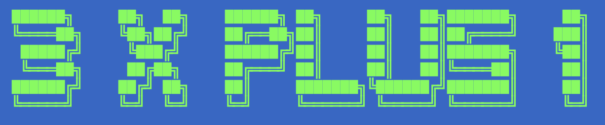

# A Demonstration of the 3x+1 Problem.

## Date: 22 2022



The demonstration of the 3xplus1 recursive function which always concverges no the same numbers. The system is defined by the following.

```
f(x)  = {3x+1} if f(x) is odd
f(x)  = (f(x)/2) if f(x) is even.
```

Put another way, 

Rules: $x = seedNumber$

    If f($x$) is odd, f(f($x$)) = 3(f($x$) + 1) + 1,
    else, f($x$) = f($x$) /2.
    Repeat until f($x$) = 4, then f($x$) = 2 then f($x$) = 1 (stop!)


For seemingly any `seednumber`, the algorithm haults on the same last three numbers; [8, 4, 2, STOP]. Below we arbitrality start the algorithm with the $seednumber = 10$, but any seed number could be used and achived the same sequence before the algorithm haults.   

## Executing code; `seednumber = 10`
For a seed number of 10, 
```
python3 threeXPlusOne.py -n 10
```
## Output
```
	 [+] Seed Number: 10
	   0,  10 	 even
	   1,  5.0 	 odd
	   2,  16.0  even
	   3,  8.0 	 even
	   4,  4.0 	 even
	   5,  2.0 	 even

	 [+] Completed at 1.0, MaxValue = 16.0
```

## Executing code; `seednumber = 30`
For a seed number of 30, 
```
python3 threeXPlusOne.py -n 30
```
## Output
```
 python3 threeXPlusOne.py -n 30

	 [+] Seed Number: 30
	   0,  30 	 even
	   1,  15.0 	 odd
	   2,  46.0 	 even
	   3,  23.0 	 odd
	   4,  70.0 	 even
	   5,  35.0 	 odd
	   6,  106.0 	 even
	   7,  53.0 	 odd
	   8,  160.0 	 even
	   9,  80.0 	 even
	   10,  40.0 	 even
	   11,  20.0 	 even
	   12,  10.0 	 even
	   13,  5.0 	 odd
	   14,  16.0 	 even
	   15,  8.0 	 even
	   16,  4.0 	 even
	   17,  2.0 	 even

	 [+] Completed at 1.0, MaxValue = 160.0
```
Note that, again, the last numbers, {8,4,2, STOP} are the ending elements of the sequence.


## Further learning: 

* Wikipedia: Collatz Conjecture
  + https://en.wikipedia.org/wiki/Collatz_conjecture

* The Simplest Math Problem No One Can Solve - Collatz Conjecture
  + https://www.youtube.com/watch?v=094y1Z2wpJg

* UNCRACKABLE? The Collatz Conjecture - Numberphile
  + https://www.youtube.com/watch?v=5mFpVDpKX70
